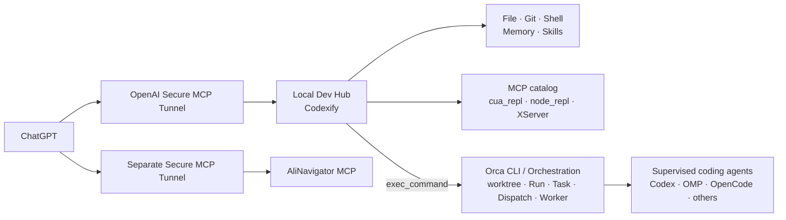

# Codexifyを開発Hub、Orcaを実行backendにする

## 正規経路

開発用途はChatGPTからCodexify 1本へ接続します。

Codexifyは `openai/session` を使って同じChatのproject bindingを永続化します。
MCP transportやCodexify processが入れ替わっても同じChatから復元できます。

新しいChatではconversation binding自体は引き継がず、exact `resumePath` で同じworkspaceを再bindします。
planとnotesはactive root単位のmemoryから `recall` します。

## worktreeはOrcaだけが管理する

Codexifyはmulti-project modeかつ `worktrees.mode=never` で使います。
source checkoutは基準点として保ち、Git管理repoへ残す変更は原則Orca管理worktreeで行います。
Local Dev Hubからの直操作は読み取り、テスト、machine config、最終統合を中心にします。
Orca worktreeは `<projects-root>/.worktrees/<repo>/<worktree>` に配置します。

これによりCodexify worktreeとOrca worktreeの二重管理を避けます。

## OrcaはCLI契約をそのまま使う

自作Orca MCPは置きません。Orca 1.4系はprompt delivery request ID、worktree create idempotency、
supervised worker、restart recoveryなどを本体側で持つため、local-mcpで状態機械を重複実装しません。

基本フローは次です。

1. 必要なら `orca worktree create --json` でworktreeを作る
2. exact `path:` selectorでcoordinator terminalを作る
3. `orchestration run-create --from <handle>`
4. `worker-start --run <run> --from <handle> --worktree path:...`
5. `worker-show` / `worker-read` で監督する
6. settled後に `worker-release`
7. coordinator terminalを閉じ、不要なworktreeだけ `worktree rm`

OrcaのCLI仕様は変化が速いため、固定したwrapperより `orca-ide skills get orchestration` を正本にします。

## 長時間処理はMCP callから分離する

ChatGPTの1ターン寿命はローカルMCPから保証できません。
そのため、長いcommandはCodexifyの `exec_command` で短くyieldし、返されたsession handleを
`write_stdin` でpollします。同じChatならMCP transportをまたいでもcommand sessionを継続できます。

長い作業はフェーズ境界で `update_plan` と必要な `remember` を更新します。
次フェーズも長い場合は無理に1ターンを維持せず、進捗を一度ユーザーへ返してから続行します。

## MCP catalog

CodexifyはCodex user configのstdio / Streamable HTTP MCPをclientとして取り込みます。
自動取込はcatalog modeを使い、upstreamの大量toolをChatGPTのtool catalogueへ直接展開しません。

現在のCodexify catalog upstreamは `cua_repl`、`node_repl`、`XServer` です。
`codexMcp.useCli=true` によりCodex CLIのeffective catalogueもcatalogへ加わり、plugin由来MCPも利用できます。
XServer専用Secure MCP Tunnelはなく、開発Hubを経由します。

## AliNavigatorだけ独立Connectorを残す

AliNavigatorは商品検索・比較という別用途のため、開発Hubへ混ぜません。
MCP本体はalinavigator-apiで管理し、このリポジトリはSecure MCP Tunnel profile、systemd、診断だけを管理します。

新しいAliNavigator Tunnelを作る場合はCodexify TunnelのOrganization / Workspace scopeを継承します。

## 外部依存はforkしない

| 依存 | 扱い |
| --- | --- |
| openai/tunnel-client | 公式配布物を使用 |
| Codexify | 公式release binaryを使用 |
| Orca | 導入済みアプリと `orca-ide` CLIを使用 |
| OpenCode / Codex等 | Orcaから起動・監督 |

バージョン依存の設定はCLIの `--help` と公式文書を正本にします。
